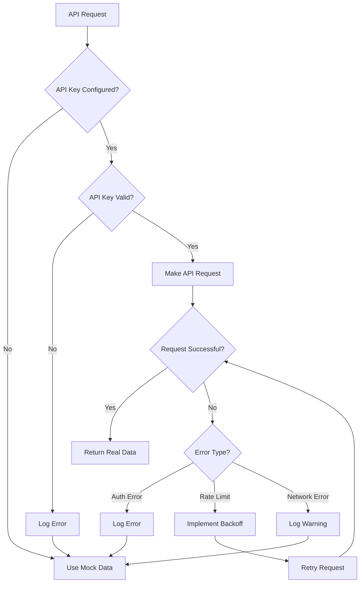

# Design Document

## Overview

This design document outlines the implementation for properly configuring and setting up the Rakuten Recipe API key in the existing healthcare food application. The solution focuses on robust environment variable management, API key validation, graceful fallback mechanisms, and comprehensive error handling to ensure seamless operation whether using real or mock data.

## Architecture

### Configuration Management Layer
- **Environment Variable Loading**: Centralized loading and validation of environment variables
- **Configuration Validation**: Runtime validation of API keys and configuration parameters
- **Environment Detection**: Automatic detection of development, staging, and production environments

### API Integration Layer
- **API Key Management**: Secure handling and validation of Rakuten API keys
- **Request Authentication**: Automatic inclusion of API keys in requests
- **Fallback Mechanism**: Seamless switching between real and mock data

### Error Handling Layer
- **Graceful Degradation**: Automatic fallback to mock data when API is unavailable
- **Error Logging**: Comprehensive logging of API-related errors and warnings
- **User Experience Protection**: Ensuring users never see API-related errors

## Components and Interfaces

### 1. Enhanced Configuration Module (`src/lib/config.ts`)

**Current State Analysis:**
- Already has basic Rakuten API configuration
- Includes feature flags for mock data usage
- Has validation function but limited error handling

**Enhancements Needed:**
```typescript
interface RakutenConfig {
  applicationId: string | undefined;
  baseUrl: string;
  rateLimit: {
    requestsPerSecond: number;
    requestsPerDay: number;
  };
  validation: {
    isConfigured: boolean;
    isValid: boolean;
    lastValidated: Date | null;
  };
}

interface ConfigValidationResult {
  isValid: boolean;
  errors: string[];
  warnings: string[];
  recommendations: string[];
}
```

### 2. API Key Validator Service

**New Component:**
```typescript
interface ApiKeyValidator {
  validateFormat(apiKey: string): boolean;
  validateConnection(apiKey: string): Promise<ValidationResult>;
  getSetupInstructions(): SetupInstructions;
}

interface ValidationResult {
  isValid: boolean;
  error?: string;
  details?: {
    rateLimitRemaining?: number;
    accountType?: string;
    permissions?: string[];
  };
}
```

### 3. Environment Setup Helper

**New Component:**
```typescript
interface EnvironmentSetup {
  checkRequiredVariables(): EnvironmentCheck;
  generateExampleConfig(): string;
  validateEnvironmentSpecificConfig(): ValidationResult;
}

interface EnvironmentCheck {
  missing: string[];
  invalid: string[];
  warnings: string[];
  isReady: boolean;
}
```

### 4. API Health Monitor

**New Component:**
```typescript
interface ApiHealthMonitor {
  checkApiHealth(): Promise<HealthStatus>;
  getLastHealthCheck(): HealthStatus | null;
  scheduleHealthChecks(): void;
}

interface HealthStatus {
  isHealthy: boolean;
  lastChecked: Date;
  responseTime?: number;
  error?: string;
  rateLimitStatus?: {
    remaining: number;
    resetTime: Date;
  };
}
```

## Data Models

### Configuration Schema
```typescript
interface RakutenApiConfig {
  // Core configuration
  applicationId: string;
  environment: 'development' | 'staging' | 'production';
  
  // API settings
  baseUrl: string;
  timeout: number;
  retryAttempts: number;
  
  // Rate limiting
  rateLimit: {
    requestsPerSecond: number;
    requestsPerDay: number;
    burstLimit: number;
  };
  
  // Fallback settings
  fallback: {
    useMockData: boolean;
    mockDataPath: string;
    fallbackTimeout: number;
  };
  
  // Monitoring
  monitoring: {
    enableHealthChecks: boolean;
    healthCheckInterval: number;
    logLevel: 'error' | 'warn' | 'info' | 'debug';
  };
}
```

### Environment Variable Schema
```typescript
interface EnvironmentVariables {
  // Required
  RAKUTEN_APPLICATION_ID?: string;
  
  // Optional with defaults
  RAKUTEN_API_TIMEOUT?: string;
  RAKUTEN_RATE_LIMIT_RPS?: string;
  RAKUTEN_ENABLE_HEALTH_CHECKS?: string;
  USE_MOCK_RECIPES?: string;
  
  // Environment detection
  NODE_ENV: string;
  VERCEL_ENV?: string;
}
```

## Error Handling

### Error Categories

1. **Configuration Errors**
   - Missing API key
   - Invalid API key format
   - Environment variable parsing errors

2. **API Errors**
   - Authentication failures (401)
   - Rate limit exceeded (429)
   - Network timeouts
   - Service unavailable (503)

3. **Runtime Errors**
   - Invalid API responses
   - Data parsing errors
   - Unexpected API changes

### Error Handling Strategy

```typescript
interface ErrorHandlingStrategy {
  // Configuration errors
  handleMissingApiKey(): void; // Log warning, enable mock mode
  handleInvalidApiKey(): void; // Log error, enable mock mode
  
  // API errors
  handleAuthenticationError(): void; // Log error, enable mock mode
  handleRateLimitError(): Promise<void>; // Implement backoff, retry
  handleNetworkError(): void; // Log warning, enable mock mode
  
  // Runtime errors
  handleInvalidResponse(): void; // Log error, return empty result
  handleParsingError(): void; // Log error, return mock data
}
```

### Graceful Degradation Flow



## Testing Strategy

### Unit Tests
- Configuration loading and validation
- API key format validation
- Error handling scenarios
- Mock data fallback mechanisms

### Integration Tests
- End-to-end API key setup flow
- Environment variable loading
- API health check functionality
- Fallback behavior verification

### Manual Testing Scenarios
- Fresh installation without API key
- Invalid API key configuration
- API key rotation
- Network connectivity issues
- Rate limit scenarios

## Implementation Phases

### Phase 1: Enhanced Configuration Management
- Improve existing config.ts with better validation
- Add comprehensive error handling
- Implement environment-specific configuration

### Phase 2: API Key Validation Service
- Create API key validator component
- Implement connection testing
- Add setup instruction generation

### Phase 3: Health Monitoring
- Implement API health checks
- Add monitoring dashboard endpoint
- Create alerting for API issues

### Phase 4: Documentation and Tooling
- Create setup documentation
- Add development tools for API key management
- Implement configuration validation scripts

## Security Considerations

### API Key Protection
- Never log API keys in plain text
- Use environment variables for all sensitive data
- Implement proper error messages that don't expose keys

### Environment Separation
- Use different API keys for different environments
- Implement proper key rotation procedures
- Add monitoring for unauthorized API usage

### Error Information Disclosure
- Sanitize error messages in production
- Log detailed errors server-side only
- Provide helpful but secure user-facing messages

## Performance Considerations

### Caching Strategy
- Cache API validation results
- Implement intelligent retry mechanisms
- Use connection pooling for API requests

### Rate Limit Management
- Implement proper rate limiting
- Add request queuing for burst scenarios
- Monitor and alert on rate limit usage

### Fallback Performance
- Ensure mock data is performant
- Implement lazy loading for large datasets
- Cache mock data appropriately